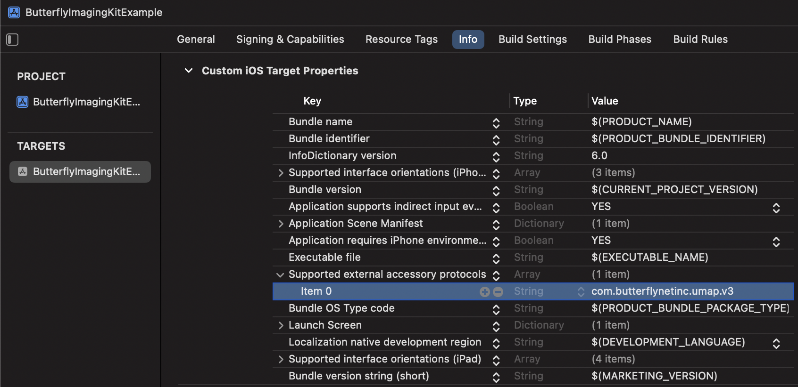
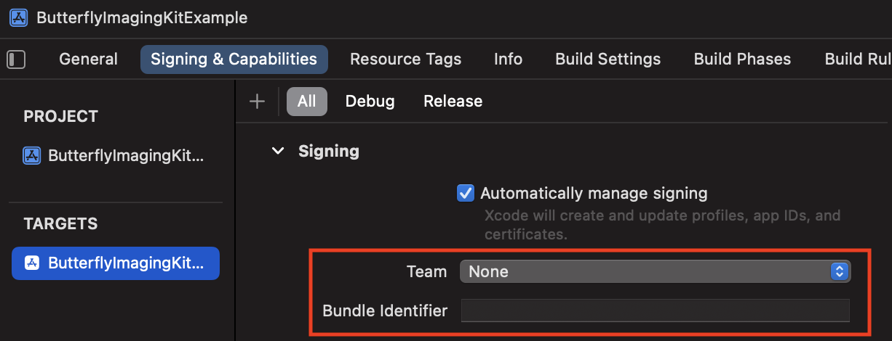
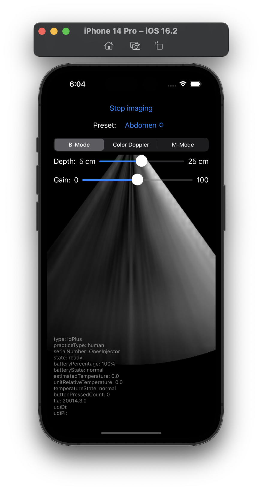

# Butterfly Imaging SDK

The Butterfly Imaging SDK allows you to quickly integrate Butterfly Network's imaging probes into your iOS app, enabling you to:
* Read B-mode, Color Doppler, and M-Mode images from the Butterfly iQ probes.
* Change the preset, mode, depth, and gain of the Butterfly iQ probes.

For a full list of capabilities that can be leveraged in your app, please reference the header files in the project (⌃⌘ + click on an object or property).

The project also contains a sample app to demonstrate its usage and help you get started quickly.

## Description

The SDK consists of a few key objects:
* **`ButterflyImaging`** - This is the main object you use to initiate the SDK and control the probe. From here, you can start or stop imaging, and change presets, gain, and depth. The status of the probe and images are read from this object via a callback closure, which is called whenever there is a new `ImagingState` available.
* **`ImagingState`** - With every change in the state of the probe, you receive a new imaging state (via the callback closure set in the `ButterflyImaging` object). This includes access to scanned images, imaging settings, probe state, battery status, etc.
* **`ButterflyImage`** - Within the `ImagingState` object, the `bModeImage` and `mModeImage` properties represent the latest image/frame from the probe. These include the image data and metadata.
* **`ImagingPreset`** - Every imaging session is set with an Imaging Preset, a predefined set of imaging parameter values for different clinical procedures such as Abdomen, Bladder, Cardiac, etc.
* **`UltrasoundMode`** - The different imaging modes supported in the SDK: B-Mode, M-Mode, and Color Doppler.

## Requirements

* Built and tested using Xcode 15.0.1 and macOS Sonoma 14.5.
* Available for iOS 16.0 or newer.
* Apps developed using the SDK should only be installed on [Butterfly supported devices](https://support.butterflynetwork.com/hc/en-us/sections/360004521832-Mobile-Devices).
* Not compatible with beta software.
* Internet connectivity is required for the initial setup of the SDK on a device, for periodic validation every 30 days, and for use on the iOS Simulator.
* The SDK does not save images collected by your app, but basic usage of the SDK is monitored.

## Installation

To start using the SDK, please follow these steps:

1. Add your [Butterfly Access Token](Docs/AccessToken.md) to your Mac.
1. In your project, open the menu: **File** > **Add Package Dependencies**, and enter our package's GitHub URL:
   ```
   https://github.com/ButterflyNetwork/ImagingSDK-iOS
   ```
1. Tap **Add Package**. If Xcode prompts for access to the keychain, enter your Mac’s password and tap **Always Allow**.
1. Ensure that the **ButterflyImagingKit** package product and your target are selected, then tap **Add Package** to finish.
1. Go to your target's **Info** tab, add a new row with the **Supported external accessory protocols** array. Set **Item 0** with the value `com.butterflynetinc.umap.v3` like so:

   

## Quick Start

Here's a brief guide to quickly get started with imaging using SwiftUI Previews. Follow these five key steps:

1. Set up the callback closure.
1. Initialize the SDK with your client key.
1. Establish a connection.
1. Start the imaging session.
1. Display the results.

```swift
import ButterflyImagingKit
import SwiftUI

private let imagingSDK = ButterflyImaging.shared
private var didStart = false

struct QuickStartView: View {
    @State var image: UIImage
    var body: some View {
        Image(uiImage: image)
            .onAppear {
                Task { await quickStart() }
            }
    }

    func quickStart() async {
        // 1. Set up callback closure to handle state changes.
        imagingSDK.states = { state, stateChanges in
            Task {
                guard !didStart else { return }
                didStart = true

                // 3. Connect the simulated probe.
                await imagingSDK.connectSimulatedProbe()

                // 4. Start imaging.
                try? await imagingSDK.startImaging()
            }

            // 5. Present image.
            guard stateChanges.bModeImageChanged, let bModeImage = state.bModeImage?.image else { return }
            image = bModeImage
        }

        // 2. Start the SDK with your client key.
        try? await imagingSDK.startup(clientKey: "CLIENT KEY")
    }
}

#Preview {
    QuickStartView(image: .remove)
}
```

> [!NOTE]
> When using a physical probe instead of the simulated one, ensure the probe is ready and presets are available before calling `startImaging` by checking: `state.probe.state == .ready && !state.availablePresets.isEmpty`. The connection is automatically established by plugging the probe into your iOS device.

## Sample App

Explore more advanced usage via the [example project](Example). It showcases the setup described above, a basic workflow for starting the SDK, reading images, and controlling the probe's capabilities.

To run the sample app:

1. Make sure you have followed our [instructions](Docs/AccessToken.md) for adding your Butterfly Access Token to your Mac.
1. Set your client key in **ButterflyImagingKitExampleApp.swift**.
1. Set your development team and a bundle identifier:

   

<br>
And you should be good to go!



## License

Copyright 2012-2024 (C) Butterfly Network, Inc.
